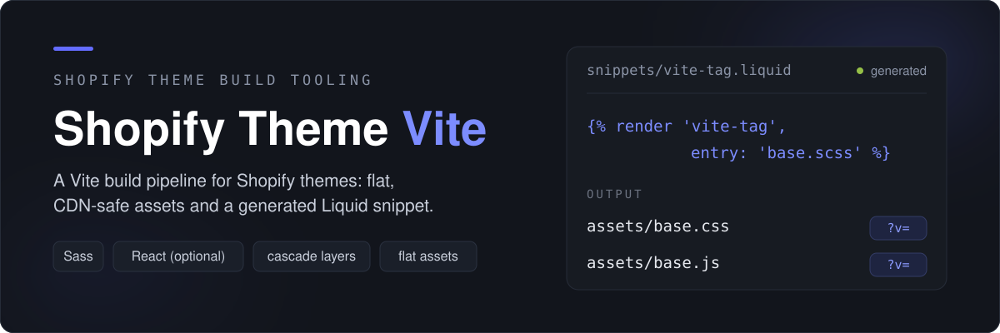
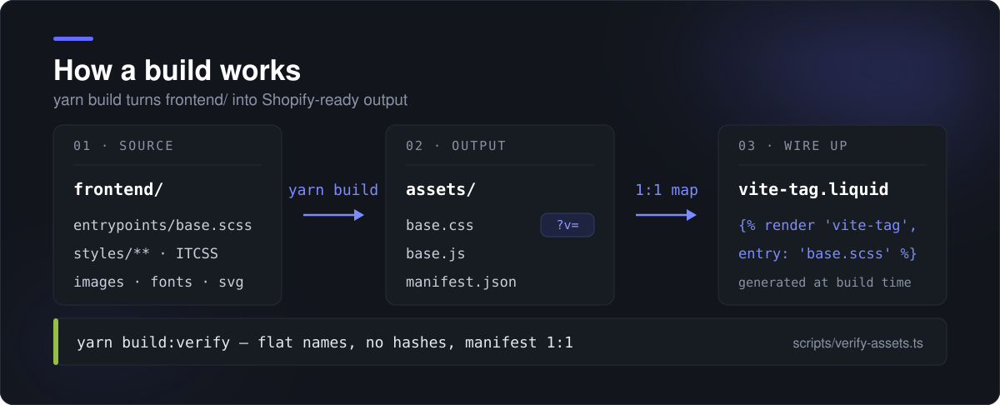
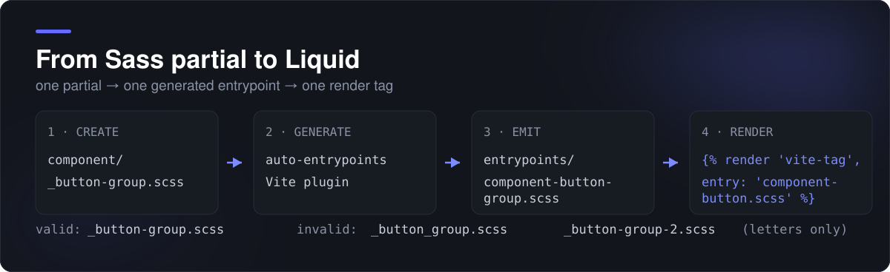
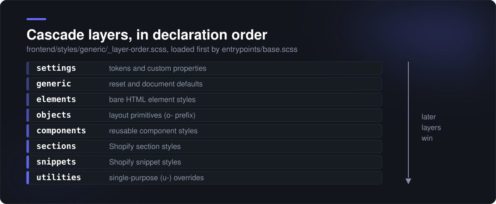

# Shopify Theme Vite

<p align="center">
  
</p>

Build tooling for Shopify themes using Vite, Sass, optional React, and a flat
`assets/` output compatible with Shopify's CDN.


## What it provides

- Sass compilation through `sass-embedded` and native CSS cascade layers.
- Flat, unhashed assets with Shopify `?v=` version query parameters.
- Image, font, and SVG optimization.
- Automatic SCSS entrypoints for component, section, and snippet styles.
- A generated `snippets/vite-tag.liquid` that maps each entrypoint to its asset.
- ESLint, Stylelint, Prettier, TypeScript checks, and asset-name verification.

## How a build works

<p align="center">
  
</p>

`yarn build` compiles `frontend/` into flat, unhashed files under `assets/` and
regenerates `snippets/vite-tag.liquid`. Stale output from the previous build is
removed first, and `versionNumbers` keeps the `?v=` query that Shopify's
`asset_url` appends so browsers revalidate on change. Liquid templates never
hard-code asset paths; they call the snippet:

```liquid

```

## Quick start

Use the Yarn version pinned in `package.json`:

```bash
yarn install
yarn build:verify
```

To run the dev server, authenticate Shopify CLI separately with
`shopify theme login`, then start Vite and the CLI together:

```bash
yarn dev
```

## Commands

| Command                  | Description                                                                             |
| ------------------------ | --------------------------------------------------------------------------------------- |
| `yarn dev`               | Runs Vite and Shopify CLI together.                                                     |
| `yarn dev:vite`          | Runs Vite only.                                                                         |
| `yarn build`             | Builds assets and regenerates `vite-tag.liquid`.                                        |
| `yarn build:verify`      | Builds and validates asset names and flat output.                                       |
| `yarn lint`              | Runs Stylelint and ESLint, including Node utilities, scripts, and ESLint configuration. |
| `yarn lint:fix`          | Applies available lint fixes.                                                           |
| `yarn format`            | Formats source, utility, root configuration, and documentation files.                   |
| `yarn check:types`       | Checks frontend and Node/Vite configuration types without emitting files.               |
| `yarn check:entrypoints` | Tests generated-entrypoint naming rules.                                                |
| `yarn check:sass`        | Compiles Sass fixtures to validate function and mixin arguments (27 tests).             |
| `yarn test`              | Runs the full Vitest suite (React components, Sass validation, entrypoints).            |
| `yarn test:watch`        | Runs the suite in watch mode.                                                           |
| `yarn test:coverage`     | Runs the suite with a V8 coverage report.                                               |
| `yarn clean`             | Removes dependencies, build artifacts, and caches.                                      |
| `yarn clean:build`       | Removes build artifacts and Vite caches only.                                           |
| `yarn fresh`             | Cleans, installs, builds, and verifies.                                                 |

## Source layout

```text
frontend/
├── entrypoints/       # base.scss/base.mts plus generated SCSS entrypoints
├── styles/
│   ├── component/     # reusable UI styles
│   ├── section/       # Shopify section styles
│   ├── snippet/       # Shopify snippet styles
│   └── …              # settings, tools, generic, elements, objects, utilities
├── images/
├── fonts/
└── svg/

assets/                # generated files published to Shopify
snippets/vite-tag.liquid # generated at build time
```

## Style entrypoints

<p align="center">
  
</p>

Create a Sass partial under `frontend/styles/component/`, `section/`, or
`snippet/`. Partial names must use a leading Sass underscore followed by
lowercase kebab-case using letters only:

```text
_button-group.scss     # valid → component-button-group.scss
_rich-text.scss        # valid → section-rich-text.scss
_button_group.scss     # invalid
_button-group-2.scss   # invalid
```

The generator creates the matching entrypoint in `frontend/entrypoints/`.
Reference it from Liquid with the generated snippet:

```liquid

```

Do not edit generated entrypoints or `snippets/vite-tag.liquid` directly.

## CSS architecture

<p align="center">
  
</p>

Styles follow ITCSS and use this layer order:

```scss
@layer settings, generic, elements, objects, components, sections, snippets, utilities;
```

The declaration lives in `frontend/styles/generic/_layer-order.scss` and is
loaded first by `frontend/entrypoints/base.scss`. See
[frontend/styles/README.md](frontend/styles/README.md) for folder-specific
conventions and the merchant color-token bridge.

## Quality gates

CI (`.github/workflows/ci.yml`) runs the same checks you can run locally:

- `yarn lint` — ESLint and Stylelint, including Node utilities and scripts.
- `yarn format:check` — Prettier over source, configuration, and documentation.
- `yarn check:types` and `yarn check:types:coverage` — type checks plus type
  coverage for frontend and Node/Vite configuration.
- `yarn check:sass` — compiles Sass fixtures to validate function and mixin
  arguments (27 tests).
- `yarn check:entrypoints` — generated-entrypoint naming rules.
- `yarn test` and `yarn test:coverage` — Vitest suite; coverage fails below the
  thresholds in `vitest.config.mjs`: 46% statements, 39% branches, 75%
  functions, 48% lines.
- `yarn build:verify` — flat names, no hashes, and manifest parity.
- `yarn check:theme` and a dependency audit (`yarn audit`, CI at
  `--severity high`); workflows are linted with actionlint.

## Browser support

This project targets the last 2 versions of evergreen browsers (Chrome, Edge, Firefox, Safari). This baseline is informed by the use of modern CSS features including CSS Cascade Layers (@layer) and CSS custom properties, which require:

- Chrome 99+ or Edge 99+
- Firefox 97+
- Safari 15.4+

Internet Explorer is not supported.

## Deployment and releases

[DEPLOYMENT.md](DEPLOYMENT.md) covers environments, the release process, and
rollback steps. Version history lives in [CHANGELOG.md](CHANGELOG.md).

## License

MIT — see [LICENSE](LICENSE).
